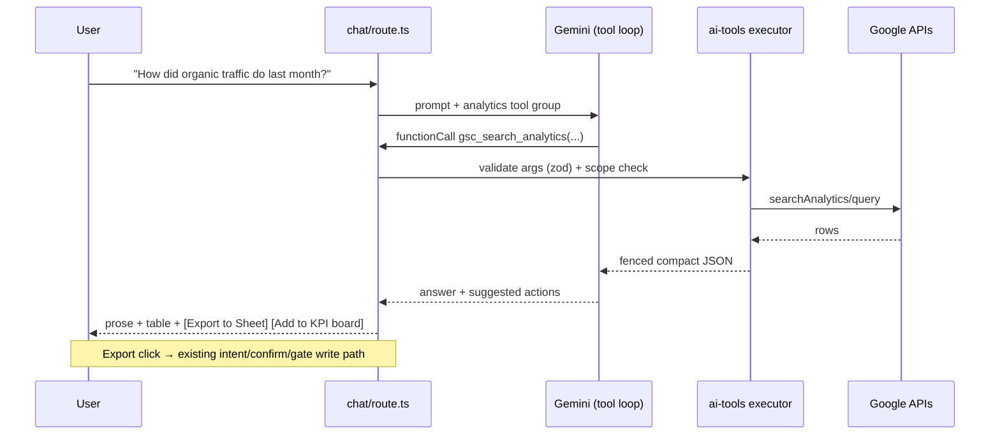
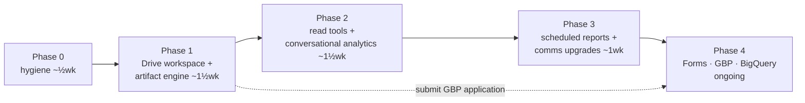

# Google Workspace Leverage Design

> [!summary]
> We ask users for ~22 Google scopes at login but exploit a fraction of them: Docs/Sheets/Slides
> "creation" is a title-plus-plain-text stub, GA4/GSC power four KPI tiles, and nothing the Hub
> creates is organized anywhere in Drive. This doc designs the path from *granted permissions* to
> *working product*: an auto-provisioned **HUB Overlay folder** in each user's Drive that receives
> everything the Hub creates; an **artifact engine** that turns chat output into real, formatted
> Docs, Sheets, Slides and Forms; **conversational analytics** over GA4 + Search Console with
> one-click export; and upgraded Gmail/Calendar/Chat/Tasks actions — all riding the existing
> intent → interview → confirm-card → gate-token → audit pipeline, plus one new architectural
> piece: **server-side read-tool function calling** for Gemini. Phases 1–2 need **zero new
> scopes**. Research grounding: Exa web research against official Google API docs (July 2026),
> sources in Appendix B.

---

## 1. Where we are today

### 1.1 Scopes requested vs. capability shipped

`GOOGLE_SCOPES` (`hub/lib/auth.ts:84-127`) requests 22 scopes. The capability matrix:

| API | Scope(s) held | Shipped today | Gap |
|---|---|---|---|
| Tasks | `tasks` | Full CRUD (`hub/lib/google.ts:61-171`) | List creation; bulk "extract action items" |
| Calendar | `calendar` (full) | List/create(+Meet)/delete (`google.ts:201-334`) | No `events.patch` update; no free/busy |
| Drive | `drive.readonly`, `drive.file` | Recent-files list + export download | **No folders, no uploads, no organization, no search tool** |
| Gmail | `gmail.readonly/send/modify` | Threads list/read, send, trash, mark-read | No drafts flow, no threading headers, no labels, no attachments |
| Google Chat | `chat.*` (5 scopes) | Spaces/messages/members, send, read-state | Digest posts; space creation (deliberately deferred) |
| Docs | `documents` | Create + one plain-text `insertText` (`google.ts:657-685`) | **No formatting, no markdown fidelity, no edits of existing docs** |
| Sheets | `spreadsheets` | Create + naive comma-split rows (`google.ts:704-727`) | No formatting/charts; no analytics export |
| Slides | `presentations` | **Title-only empty deck** (`google.ts:825+`) | The user-visible complaint: "can't make Slides from AI chat" |
| GA4 | `analytics.readonly` | 4 KPI tiles, 7-day window, single env-var property (`hub/lib/kpi-sources/ga4.ts:79`) | **No conversational analytics, no property discovery, no reports** |
| Search Console | `webmasters.readonly` | 1 KPI row (`hub/lib/kpi-sources/searchConsole.ts`) | Same |
| Contacts / Directory | `contacts.readonly`, `admin.directory.user.readonly` | Recipient resolution | Fine as-is |

The consent screen users see (the list Danny pasted) is the **union of everything ever granted**
to the casatrejo.com OAuth client — it includes full Drive, Forms, GBP, BigQuery, Datastore and
Apps Script scopes that the *current* code never requests. `include_granted_scopes: 'true'`
(`auth.ts:381`) rolls old grants forward, so returning users keep granting them. §8 reconciles
this.

### 1.2 How actions work today (and why we keep it)

There is **no LLM function calling**. The chat pipeline is: intent classifier
(`app/api/chat/detect-intent/route.ts`) → deterministic interview (`hub/lib/interview.ts:85-216`)
→ `ActionConfirmCard` → `executeAction` (`hub/lib/actions/executeAction.ts:128`) → `/api/google/*`
route guarded by gate token (`hub/lib/requireGate.ts`) → `ai_action_log` audit
(`hub/lib/ai-audit.ts`). The system prompt *forbids* the model from claiming to act
(`hub/lib/gemini.ts:66-80`).

This is a good architecture for **writes** — human-in-the-loop confirmation, quality gates, rate
limits, audit — and every new write capability below plugs into it as a new intent. It is the
wrong architecture for **reads**: "how did organic traffic do last month?" should not require an
interview; it requires the model to run a query and answer. That's the one new piece (§7).

---

## 2. Design principles

1. **Everything the Hub creates lands in the user's Drive, organized.** No orphan files at Drive
   root (today's behavior). One branded folder per user, auto-provisioned, subfoldered by type.
2. **`drive.file` is the ownership boundary.** The Hub folder and all artifacts are app-created,
   so the non-sensitive `drive.file` scope fully covers creating, organizing, editing and
   re-reading them. We never need the restricted full `drive` scope. (`drive.readonly` — already
   held — covers referencing the user's *other* files.)
3. **Reads are free, writes are confirmed.** Read-only tools (analytics queries, Drive search,
   free/busy) auto-execute inside the model loop. Anything that sends, creates, mutates or
   deletes outside the Hub folder goes through interview + confirm card + gate token, unchanged.
4. **Deterministic compilers, not LLM-emitted API calls.** The model emits validated content
   (markdown, a zod-checked deck outline, a table); TypeScript compiles that to `batchUpdate`
   requests. Research is unambiguous that LLMs cannot reliably emit raw Slides/Docs index math.
5. **Degrade per scope, never per login.** Granular consent means users can uncheck individual
   scopes. Each capability gates on its scope (we already store granted `scope` in
   `google_oauth_tokens`, `hub/lib/schema.ts:231`) and surfaces the existing `MISSING_SCOPE` →
   re-consent flow (`hub/lib/google-session.ts:77-95`) rather than failing the session.
6. **Reuse the repo's own conventions**: per-API modules, `x-cron-secret` scheduled endpoints,
   TanStack Query hooks, panel cards, `fenceUntrusted` for third-party content.

---

## 3. The HUB Overlay Drive workspace (auto-provisioned folder)

The anchor feature: a folder the Hub owns in each user's My Drive.

### 3.1 Structure

```
HUB Overlay/                    ← root, name per-tenant configurable
├── Documents/                  ← Docs from chat & skills (Decision Memo, SCPR, …)
├── Presentations/              ← Slides decks
├── Spreadsheets/               ← Sheets (incl. analytics exports)
├── Reports/
│   └── 2026-07/                ← scheduled GA4/GSC/business digests, month-bucketed
├── Forms/                      ← Phase 4
├── Assets/                     ← images used inside decks/docs
└── Templates/                  ← tenant-branded template decks/docs (files.copy sources)
```

File naming: `YYYY-MM-DD — <Title>`. Every file and folder carries private, app-only Drive
metadata: `appProperties: { hubOverlay: 'root' | 'artifact', kind, tenantId, artifactId? }`
(≤124 bytes/pair, invisible to other apps, survives rename/move).

### 3.2 Provisioning algorithm (`hub/lib/google/drive-workspace.ts`)

Lazy — provisioned on **first artifact write**, not at login (no surprise folders for users who
never create anything).

```
ensureWorkspace(accessToken, tenantId, email) → { rootId, folders }
1. DB lookup (drive_workspaces row) → candidate rootId
2. Verify: GET /drive/v3/files/{rootId}?fields=id,trashed → fresh? return
3. Fallback rediscovery: GET /drive/v3/files?q=
     appProperties has { key='hubOverlay' and value='root' }
     and mimeType='application/vnd.google-apps.folder' and trashed=false
4. Else create: POST /drive/v3/files { name, mimeType: folder, appProperties }
5. Upsert DB row; ensure subfolder on demand (same verify-or-create per subfolder)
```

Rules: if the user **renames or moves** the folder, we follow the ID — nothing breaks. If the
user **trashes** it, we respect that as intent, log it, and create a fresh folder on next write
(never silently untrash). Shortcuts (`application/vnd.google-apps.shortcut`) are resolved via
`shortcutDetails.targetId`, never treated as the folder itself.

New table:

```sql
CREATE TABLE drive_workspaces (
  id            serial PRIMARY KEY,
  tenant_id     text NOT NULL,
  email         text NOT NULL,
  root_folder_id text NOT NULL,
  folders       jsonb NOT NULL DEFAULT '{}',   -- { documents: id, presentations: id, … }
  created_at    timestamptz NOT NULL DEFAULT now(),
  last_verified_at timestamptz,
  UNIQUE (tenant_id, email)
);
```

### 3.3 Placement mechanics per creator API

| Artifact | How it lands in the folder |
|---|---|
| Doc (from markdown) | Drive multipart upload with `parents` set at create (§4.1) — one call |
| Sheet | `POST /drive/v3/files` with `mimeType: application/vnd.google-apps.spreadsheet` + `parents` (Sheets `spreadsheets.create` cannot set a parent), then Sheets API writes |
| Slides | `presentations.create` (no parent support) → `PATCH /drive/v3/files/{id}?addParents=<folder>&removeParents=root` |
| Form | `forms.create` → same `addParents` move |
| Uploads (assets, exports) | `uploadType=multipart` with `parents` |

All moves/edits are on app-created files ⇒ covered by `drive.file`.

### 3.4 Surfacing

- **Chat artifact card** (extends `SolutionCard`, `hub/app/components/ChatEnhancements.tsx:25`):
  thumbnail, title, breadcrumb "HUB Overlay › Presentations", `webViewLink` open button,
  follow-up actions (Rename / Email as attachment / Regenerate section).
- **Settings › Connected Services**: "Hub Drive folder" row — link to folder, creation date,
  artifact count, *Re-provision* button.
- **DocumentsSection** (left panel): new "Created by Hub" filter driven by the same
  `appProperties` query.

---

## 4. Artifact engine — real Docs, Sheets, Slides, Forms from chat

### 4.1 Docs: markdown in, formatted Doc out (the 80% win, ~1 API call)

Since July 2024 Drive natively converts Markdown ⇄ Docs. Replace the plain-`insertText` stub:

```
POST https://www.googleapis.com/upload/drive/v3/files?uploadType=multipart
  metadata: { name, mimeType: 'application/vnd.google-apps.document',
              parents: [documentsFolderId], appProperties: {…} }
  media:    Content-Type: text/markdown  →  <LLM markdown>
```

Headings, bold/italic, lists, tables, links convert with high fidelity. No index math.
- **Editing Hub-created docs**: `GET /files/{id}/export?mimeType=text/markdown` → model revises →
  `PATCH upload/…/files/{id}?uploadType=multipart` re-import. (Round-trip drops comments — fine
  for Hub-owned artifacts; documented in the card UI.)
- **User-owned docs** (via `drive.readonly`): never mutate — produce a *revised copy* in the
  workspace instead.
- Images inside markdown convert poorly → strip them during compile and post-insert via Docs
  `insertInlineImage` where needed.
- Existing skills that already produce structured prose (Decision Memo, SCPR, Storyline,
  meeting-prep) get an **"Export to Google Doc"** action on their panels — the panel JSON is
  rendered to markdown and shipped through the same path.

### 4.2 Slides: DeckSpec → compiler → batchUpdate (the headline feature)

The model never emits API requests. It emits a zod-validated outline:

```ts
const DeckSpec = z.object({
  title: z.string(),
  slides: z.array(z.object({
    layout: z.enum(['TITLE','TITLE_AND_BODY','SECTION_HEADER','TITLE_AND_TWO_COLUMNS',
                    'MAIN_POINT','BIG_NUMBER','CAPTION_ONLY','BLANK']),
    title: z.string().max(90),
    bullets: z.array(z.string().max(180)).max(7).optional(),
    bigNumber: z.string().optional(),        // BIG_NUMBER layout
    speakerNotes: z.string().optional(),
    image: z.object({ assetId: z.string(), caption: z.string().optional() }).optional(),
  })).min(1).max(30),
})
```

A deterministic compiler (`hub/lib/google/slides-compiler.ts`) turns this into one
`presentations.create` + batched `batchUpdate` calls:

- `createSlide` with `slideLayoutReference.predefinedLayout` **and `placeholderIdMappings`** —
  we assign our own objectIds to the layout's placeholders so `insertText` into them rides the
  *same* batch (Google's documented performance/quota best practice).
- Speaker notes via the notes-page placeholder; text styling via `updateTextStyle` ranges.
- One batch per ~10 slides (batches are atomic — a failed batch fails whole, so chunking gives
  resumability; retry with truncated exponential backoff on 429).
- **Images**: Slides `createImage` requires a *publicly fetchable URL* (fetched once at insert,
  ≤50 MB, ≤25 MP). Drive links are auth-walled, so assets uploaded to `Assets/` are served
  through a short-lived HMAC-signed public route on our app: `/api/assets/{driveId}?exp=…&sig=…`
  (10-minute validity — Slides fetches exactly once). No permission flipping on the Drive file.
- **Thumbnails for the chat card**: `GET /presentations/{id}/pages/{pageId}/thumbnail` — but the
  returned `contentUrl` expires in ~30 min and `getThumbnail` is an "expensive read" (60/user/min
  quota), so the server proxies + caches bytes keyed on presentation revisionId.

**Template path** (recurring formats — weekly report, QBR): designers keep branded decks in
`Templates/`; generation is Drive `files.copy` + one `batchUpdate` of `replaceAllText` on
`{{placeholder}}` tags + `replaceAllShapesWithImage`. This is Google's officially recommended
merge pattern and what SlidesGPT-style enterprise tools do.

**UX (borrowed from Gamma/Plus AI research):** outline-first. The interview collects
topic/audience/slide-count → model drafts the DeckSpec → **confirm card shows the outline** →
user tweaks/approves → compiler runs with per-slide progress → artifact card with thumbnail.
Follow-ups operate per-slide ("rewrite slide 4", "make 6 punchier") via targeted
`deleteObject`+`createSlide` at the same index — never whole-deck regeneration.

### 4.3 Sheets: formatted data + analytics exports

`createGoogleSheet` upgrade: Drive-create into `Spreadsheets/` → `values.update`
(`USER_ENTERED`) → one `spreadsheets.batchUpdate`: `repeatCell` bold header,
`updateSheetProperties` frozen row, `autoResizeDimensions`, optional `addChart`
(`basicChart` LINE/COLUMN from the data range). Payloads ≲2 MB per write.
This function doubles as the **export target for every analytics answer** (§5) and for Forms
response summaries.

### 4.4 Forms (Phase 4 — needs new scopes `forms.body`, `forms.responses.readonly`)

- `forms.create` honors **title only** → everything else via `batchUpdate` (`createItem` ordered
  by index, `updateSettings` for quizzes). Supported: choice/text/scale/date/time/rating/grid.
  **Not supported by the API: file-upload questions** — the interview must say so.
- Responses: poll `responses.list?filter=timestamp > <last>` (Pub/Sub watches expire every 7
  days — polling is the right first implementation). "Summarize responses" → Sheet + Doc.
- Use cases: client intake forms, post-meeting feedback, campaign briefs — created from chat,
  stored in `Forms/`, response digests to Gmail/Chat.

---

## 5. Conversational analytics — GA4 + Search Console (+ BigQuery later)

### 5.1 Property/site discovery and selection

Today GA4 is a single `GA4_PROPERTY_ID` env var (`hub/lib/kpi-sources/ga4.ts:79`). Replace with
per-tenant configuration, discovered from the APIs the user already authorized:

- GA4: `GET https://analyticsadmin.googleapis.com/v1beta/accountSummaries` (works with
  `analytics.readonly`) → Settings picker → `google_prefs.ga4_property_id`.
- GSC: `GET /webmasters/v3/sites` → picker → `google_prefs.gsc_site_url`.
- New table `google_prefs` (tenant_id UNIQUE, ga4_property_id, gsc_site_url, bigquery_project_id,
  gbp_account_id, gbp_location_ids jsonb, updated_by, updated_at). KPI sync
  (`app/api/kpis/sync/route.ts`) reads tenant prefs with env-var fallback.

### 5.2 Read tools (executed inside the model loop, no confirm card)

| Tool | Backing call | Notes |
|---|---|---|
| `ga4_run_report` | `POST …/properties/{id}:runReport` | model supplies dimensions/metrics/dateRanges/filters/orderBys/limit |
| `ga4_realtime` | `:runRealtimeReport` | "right now" questions; separate quota bucket |
| `gsc_search_analytics` | `POST …/sites/{site}/searchAnalytics/query` | dims: query/page/date/device/country; `dataState:'all'` for freshness; 16-month window |
| `drive_search` | `GET /drive/v3/files?q=…` | user's Drive (readonly) + Hub workspace |
| `calendar_freebusy` | `POST /calendar/v3/freeBusy` | availability answers |
| `gmail_search` | existing thread search | already implemented, exposed as a tool |

Guardrails baked into the executor, not the prompt:
- **Validation**: GA4 dimension/metric names checked against
  `GET properties/{id}/metadata` (24 h cache, includes custom definitions) before the API call —
  turns hallucinated fields into a correctable tool error, not a 400.
- **Quota stewardship**: every runReport sends `"returnPropertyQuota": true`; per-tenant hourly
  token budget with circuit-break (Standard GA4 = 40k tokens/property/hour, 14k for our project's
  35% share); identical-query cache 15 min (in-process LRU — single Cloud Run service).
- **Result shaping**: rows are capped (default `limit: 50`) and returned to the model as compact
  JSON; anything bigger goes straight to a Sheet instead of the context window.
- GSC caveats encoded: query+page combined requests drop anonymized rows; per-site 1,200 QPM.

### 5.3 Product surfaces

1. **Chat Q&A**: "which pages gained the most organic clicks since the redesign?" → GSC tool →
   inline table + trend sentence. Every analytics answer carries actions: **Export to Sheet**
   (§4.3), **Add to KPI board** (writes a `kpis` row via existing optimistic-version path),
   **Make it a slide** (feeds §4.2 BIG_NUMBER/chart slide).
2. **Insights panel**: a `DataInsightsPanel`-style tool panel rendering the query, table and
   chart with drill-in — reusing the existing `TOOL_PANEL_MAP` registry
   (`hub/app/components/panels/index.tsx:26`).
3. **Scheduled digests** (§6.4): weekly/monthly report → Doc/Slides in `Reports/2026-MM/` +
   optional Gmail/Chat delivery.

### 5.4 BigQuery (Phase 4, admin-gated)

For deep/joined/long-history analysis beyond the Data API (which samples >10 M events and rolls
up high-cardinality rows into "(other)"): link GA4 → BigQuery export **early** (no backfill
exists; standard tier caps daily batch export at 1 M events/day), then a `bigquery_query` tool via
`POST /bigquery/v2/projects/{project}/queries` (`jobs.query`) with the user's token, scope
`bigquery.readonly`. NL→SQL stays admin-only with the generated SQL shown in the confirm card.
First 1 TB/month on-demand processing is free.

---

## 6. Comms & productivity upgrades (Gmail, Calendar, Chat, Tasks)

### 6.1 Gmail — drafts-first, threads that actually thread, labels

- **Drafts-first send**: `send_gmail` intent switches from `messages.send` to `drafts.create`
  (10 quota units) → `EmailPreviewCard` shows the *actual* draft (already sanitized via
  DOMPurify) → confirm → `drafts.send` (100 units). The draft survives in Gmail if the user
  walks away — nothing is lost, nothing sent silently. This is strictly better HITL than today.
- **Reply threading**: replies must set all three of `threadId`, `In-Reply-To`, `References`
  (+ matching `Subject`) in the RFC 2822 raw payload — today's send route sets none, so "reply"
  starts new threads.
- **Attachments from the workspace**: "email the deck to Maria" → `files.export` (pptx/pdf,
  ≤35 MB Gmail limit) → multipart MIME. Recipient resolution already exists
  (`resolveRecipient`, `google.ts:776`).
- **Labels/triage** (`gmail.modify`, already held): a `Hub/` label namespace; Focus-queue
  actions grow "label as…" alongside trash/save-as-task; optional AI triage rules later.

### 6.2 Calendar — complete the CRUD, answer availability

- Add `events.patch` (update) — today only create/delete exist, so "move my 3pm to 4pm" fails.
- `calendar_freebusy` read tool (§5.2) for "when am I free Thursday?".
- `sendUpdates=all` on attendee-bearing mutations, stated on the confirm card ("this emails 3
  attendees").

### 6.3 Google Chat — digests and summaries within real constraints

User-token messages are **text-only** (cards require app credentials; user-auth cards are still
Developer Preview) and the sender must be a space member — both already true of our send path.
Additions: "post my weekly summary to #leadership" (compiled digest text + artifact links) and
"summarize this space" (existing message reads + fenced summarization). Space creation stays
deferred (`spaces.create` write scope intentionally not requested; revisit on demand).

### 6.4 Scheduled reports & briefings (reuses the cron-secret pattern)

New route `POST /api/reports/run` guarded by the existing constant-time `x-cron-secret` check
(`app/api/kpis/sync/route.ts:30`), fired by Cloud Scheduler (project `rxfit-automation`, same as
deploy). Per-tenant report configs (stored in `google_prefs.reports jsonb`): weekly GA4+GSC
digest, monthly business review deck. Pipeline: analytics tools → markdown/DeckSpec → artifact
engine → `Reports/2026-MM/` → optional Gmail draft-or-send + Chat post. Uses the **stored
refresh token** (`google_oauth_tokens`) to mint access tokens server-side — the same mechanism
the session refresh already uses, so no new token plumbing. Each run logs to `ai_action_log`
with actor `system:cron`.

### 6.5 Tasks — bulk extraction

"Turn this thread / meeting doc into tasks" → model proposes a checklist → confirm card with
per-item checkboxes → batch `createTask`. (Tasks API has no batch endpoint; loop with backoff.)

---

## 7. Read-tool function calling — the one architectural addition

### 7.1 Design

- New registry `hub/lib/ai-tools/` — each tool = zod schema + scope requirement + executor +
  result-fencing rule. Tools are **read-only by construction**; write intents remain exclusively
  in the interview pipeline. The registry is the single source for (a) Gemini
  `functionDeclarations`, (b) executor dispatch, (c) per-scope gating.
- **Tool-group routing**: Google's guidance is ≤10–20 active tools per request. The existing
  intent detector (`detect-intent`) already classifies the message; it now also selects a tool
  group (`analytics` | `workspace-files` | `comms` | `none`) so each request carries a small,
  relevant tool set.
- Loop: `chat/route.ts` gains a bounded tool loop (max 4 rounds, 10 s/tool timeout, results
  streamed as SSE `tool_status` events so the UI shows "Querying GA4…"). Tool results pass
  through `fenceUntrusted` (`hub/lib/prompt-safety.ts`) before re-entering the context — Drive
  filenames, email snippets and even GA4 dimension values (page titles!) are third-party text.
- **System prompt change**: the anti-fabrication block (`gemini.ts:66-80`) is *narrowed*, not
  removed — "you may state facts returned by tools this turn; you still never claim to have
  performed writes." The block stays test-locked (`gemini-prompt.test.ts`).
- **SDK note**: `@google/generative-ai` has been deprecated since Aug 2025 (critical-fix-only).
  Migrate `hub/lib/gemini.ts` to **`@google/genai`** as part of this workstream — it's the
  supported home of `functionCallingConfig` (`AUTO`/`ANY`/`VALIDATED` modes) and current models.
  The Claude raw-fetch path (`hub/lib/claude.ts`) gets the same tool schemas translated to
  Anthropic `tools` format so provider failover keeps tool parity.

### 7.2 Sequence



---

## 8. Scope & consent plan

### 8.1 No new scopes for Phases 1–3

Everything in §3–§7 runs on scopes already in `GOOGLE_SCOPES`. This is the central finding: the
headline features are pure implementation work.

### 8.2 Additions when their phase lands (all via incremental re-consent)

| Scope | Class | Unlocks | When |
|---|---|---|---|
| `forms.body`, `forms.responses.readonly` | sensitive | §4.4 Forms | Phase 4 |
| `business.manage` | sensitive | §9 GBP reviews/posts/performance | Phase 4 (apply for API access now — see below) |
| `bigquery.readonly` | sensitive | §5.4 | Phase 4 |
| `script.projects`, `script.deployments` | sensitive | Apps Script automations | Only with a concrete use case (see 8.4) |

Mechanics: feature detects missing scope → `MISSING_SCOPE` response → client fires
`signIn('google', …, { scope: <full updated list>, prompt: 'consent' })` exactly as the existing
marker flow does (`useChatEngine.ts:974-980`); `include_granted_scopes` preserves prior grants.
Extend `googleWriteErrorResponse`-style handling to **read** routes too (today only writes emit
`MISSING_SCOPE`; reads degrade into the generic 401 loop — flagged during exploration).

### 8.3 Reconcile the consent screen (cleanup, not code)

The pasted login list shows historically-granted scopes the code no longer requests (full
`drive`, `gmail` full mail.google.com wording, `datastore`, `cloud-platform`, Apps Script, GSC
write, Calendar sharing wording, GBP, BigQuery, Forms). Actions:
1. In the Cloud Console OAuth config, trim the registered scope list to what the code requests
   plus the Phase-4 additions — the consent screen then matches reality.
2. **Do not** adopt full `drive` or `datastore`/`cloud-platform` user scopes — no feature here
   needs them (`drive.file` + `drive.readonly` cover everything; Vertex uses the service
   account).
3. `hub_users.google_refresh_token` (`schema.ts:35`) is a dead legacy column superseded by
   `google_oauth_tokens` — confirm and drop in a migration.
4. Fix the stale `prompt: 'consent'` snippet in `hub/docs/runbooks/google-oauth-scopes.md:52-61`
   (contradicts the deliberate removal in `auth.ts:365-380`).

### 8.4 Apps Script — recommendation: defer

With user OAuth we *can* create/update script projects and deployments, but the payoff is weak:
`scripts.run` requires the script to share **our app's** Cloud project (user scripts on default
projects → 403), there is no REST resource for installing time-driven triggers, and every
scheduled-automation use case here is served better by our own Cloud Scheduler + cron-secret
routes (§6.4). Keep the scopes un-requested until a concrete "install something into the user's
account" feature exists.

---

## 9. Google Business Profile — start the clock now

GBP is the one API where OAuth consent is not enough: enabling the APIs yields **quota 0** until
Google approves the Cloud project (application form submitted from an owner/manager email of a
profile that's been verified and active 60+ days; ~14-day review; approved = 300 QPM default).
The Settings "Connected Services" card already has GBP env slots (`app/settings/page.tsx:819-828`)
but no client.

**Action item (no code, do during Phase 1):** submit the GBP API access application for
`rxfit-automation`.

Once approved (Phase 4 code): Account Management + Business Information APIs for
accounts/locations; **reviews inbox** (legacy v4 `accounts/*/locations/*/reviews` — list + AI-
drafted `reply` behind confirm cards); **performance metrics** (Business Profile Performance API
`fetchMultiDailyMetricsTimeSeries` — search/maps impressions, calls, direction requests →
KPI board + digests); local posts via v4 `localPosts` (still API-supported; Q&A API died Nov
2025). Review replies are outward-facing → same gate-token + audit treatment as Gmail sends.

---

## 10. Cross-cutting: quotas, resilience, security

- **Backoff**: shared truncated-exponential-backoff-with-jitter helper in the new
  `hub/lib/google/client.ts` (min((2^n)+jitter, 64 s)) honoring `Retry-After`, applied to 429 +
  `403 rateLimitExceeded` (Drive signals quota via 403). Slides/Docs/Sheets writes: 60/min/user;
  Drive: 325k units/min/user (list=100, edit=50 units); Gmail: 6k units/min/user (send=100).
  Headroom is ample for a small team; the backoff is for burst safety (deck compile ≈ 4–6 writes).
- **Atomicity**: batchUpdate batches are all-or-nothing — compiler chunks slides ~10/batch and
  records progress on the artifact row so a failed batch resumes, not restarts.
- **Audit**: every write keeps the gate-token + `ai_action_log` discipline; artifact writes also
  record the Drive file id in `tool_artifacts.output` so provenance survives.
- **Prompt injection**: all tool results and any Drive/Gmail/Chat content entering the model are
  fenced (`fenceUntrusted`); artifact cards render via the existing safe markdown renderer
  (no `dangerouslySetInnerHTML`, `MessageContent.tsx:6-12`).
- **Token lifecycle**: unchanged — the transient/fatal refresh classification
  (`hub/lib/auth-refresh.ts`) is already right. Scheduled reports reuse stored refresh tokens;
  their runs also serve as keep-alive against Google's 6-month-unused revocation. Note Google's
  cap of 100 live refresh tokens per account per client.
- **Verification/compliance**: `gmail.readonly/modify` are **restricted** scopes — an External
  production app storing message data server-side triggers restricted-scope verification + an
  annual CASA assessment. The Hub's sign-in is a closed allowlist (`auth.ts:412-440`) of org
  users; if all users share the Workspace org, marking the OAuth app **Internal** removes
  verification/CASA entirely (and the 100-user cap and testing-mode 7-day token expiry never
  apply). Confirm the console setting during Phase 0.
- **New-API enablement** (Console, per `google-oauth-scopes.md` runbook ordering): Analytics
  Admin API (for accountSummaries) now; Forms/GBP/BigQuery APIs at Phase 4.

---

## 11. Rollout



| Phase | Delivers | Scopes | Key files |
|---|---|---|---|
| **0** | Split `lib/google.ts` (30 KB) into `lib/google/*` per-API modules + shared client/backoff; `MISSING_SCOPE` on read routes; drop legacy token column; fix stale runbook; confirm Internal app type | none | `lib/google/*`, `lib/google-session.ts`, migration |
| **1** | `drive_workspaces` + `ensureWorkspace`; markdown→Doc; DeckSpec→Slides compiler + outline confirm + thumbnails + signed asset route; Sheets formatting; artifact cards; Settings folder row; panel "Export to Doc" | none | `lib/google/{drive-workspace,docs,slides,slides-compiler,sheets}.ts`, `app/api/google/*`, `app/api/assets/`, `executeAction.ts:338-383` upgrades |
| **2** | `@google/genai` migration; `lib/ai-tools/` registry + bounded tool loop + tool-group routing; GA4/GSC pickers (`google_prefs`); metadata validation + quota guards; export-to-Sheet / add-to-KPI actions; insights panel | none | `lib/gemini.ts`, `app/api/chat/route.ts`, `lib/ai-tools/*`, `app/settings/…` |
| **3** | `/api/reports/run` + Cloud Scheduler; report configs; Gmail drafts-first + threading + labels + attachments; `events.patch` + freebusy; bulk task extraction | none | `app/api/reports/`, `lib/google/{gmail,calendar}.ts` |
| **4** | Forms builder + response digests; GBP reviews/performance/posts (post-approval); BigQuery tool; template decks | `forms.*`, `business.manage`, `bigquery.readonly` | `lib/google/{forms,gbp,bigquery}.ts` |

Testing per phase follows the house pattern: vitest route/unit suites (compiler gets
golden-file DeckSpec→requests tests; workspace provisioning gets a mocked-Drive state machine
covering rename/trash/delete), Playwright e2e with mocked `/api/google/*`, coverage ratchet
respected, prompt changes update `gemini-prompt.test.ts` deliberately.

## 12. Open questions for Danny

1. **Folder naming**: "HUB Overlay" as the root folder name, or tenant-branded ("Casa Trejo
   Hub")? Per-tenant setting proposed, default "HUB Overlay".
2. **Permissions mapping**: artifact creation stays `staff` (like today's create intents);
   analytics read tools available to `staff`; BigQuery/NL-SQL `admin` — confirm.
3. **GA4/GSC defaults**: one property/site per tenant (proposed) or per user?
4. **GBP application**: who owns submitting it (needs an owner/manager email on the profile)?
5. **OAuth app user type**: is the Cloud Console consent screen currently Internal or External?
   (Determines the CASA question in §10.)
6. Scheduled digests: which cadence/recipients to start — weekly GA4+GSC email to admins +
   monthly review deck?

---

## Appendix A — API cheat sheet (verified July 2026)

| API | Base | Workhorse endpoints | Limits that matter |
|---|---|---|---|
| Drive v3 | `www.googleapis.com/drive/v3` (+`/upload`) | files.create/copy/update/list/export, multipart upload w/ MIME conversion | 325k units/min/user (list 100u, edit 50u); export ≤10 MB; `appProperties` ≤124 B/pair, 30 keys/app |
| Docs v1 | `docs.googleapis.com/v1` | documents.create, batchUpdate | writes 60/min/user; **markdown via Drive conversion preferred** |
| Slides v1 | `slides.googleapis.com/v1` | presentations.create, batchUpdate, pages.getThumbnail | writes 60/min/user; thumbnails 60/min/user, URL ~30 min TTL; image URLs public-fetch-once ≤50 MB/25 MP |
| Sheets v4 | `sheets.googleapis.com/v4` | spreadsheets.create, values.update/append, batchUpdate(addChart) | 60 read + 60 write/min/user; ≲2 MB/write |
| Forms v1 | `forms.googleapis.com/v1` | forms.create (title only), batchUpdate, responses.list | no file-upload questions; watches expire 7 d (Pub/Sub only) |
| Gmail v1 | `gmail.googleapis.com/gmail/v1` | drafts.create/send, messages.send, threads, labels, batch (≤100) | 6k units/min/user; send 100u; ≤35 MB; watch expires 7 d |
| Calendar v3 | `www.googleapis.com/calendar/v3` | events.insert/patch (`conferenceDataVersion=1` for Meet), freeBusy | freebusy ≤50 cals/query |
| Chat v1 | `chat.googleapis.com/v1` | spaces.messages.create (user auth = text-only), spaces.list | requires Chat-app config (already live) |
| GA4 Admin | `analyticsadmin.googleapis.com/v1beta` | accountSummaries.list | pageSize ≤200 |
| GA4 Data | `analyticsdata.googleapis.com/v1beta` | runReport, runRealtimeReport, metadata | 40k tokens/property/hr (14k our share), 10 concurrent, ≤250k rows |
| Search Console | `www.googleapis.com/webmasters/v3` | sites.list, searchAnalytics.query | 1,200 QPM/site; 16-month window; rowLimit ≤25k; URL-inspect 2k/day/site |
| GBP | `mybusiness*.googleapis.com` | v4 reviews+localPosts; Performance `fetchMultiDailyMetricsTimeSeries` | **quota 0 until approved**; 300 QPM after; location edits 10/min |
| BigQuery v2 | `bigquery.googleapis.com/bigquery/v2` | jobs.query | GA4 daily export cap 1 M events (standard); 1 TB/mo free |
| Apps Script v1 | `script.googleapis.com/v1` | projects.create/updateContent, deployments | `scripts.run` needs shared Cloud project — see §8.4 |

## Appendix B — Research sources

Full URL list captured in the research pass (Exa, July 2026). Primary references:

- Slides: developers.google.com/workspace/slides — batchUpdate, create-slide
  (`placeholderIdMappings`), merge-template guide, getThumbnail, limits
- Docs/Markdown: workspaceupdates.googleblog.com (2024-07-16 markdown import/export);
  developers.google.com/workspace/drive — ref-export-formats, manage-uploads, properties,
  search-files, limits; developers.google.com/workspace/docs (tabs GA 2025-04-09)
- Sheets: developers.google.com/workspace/sheets — values, charts samples, limits
- Forms: developers.google.com/workspace/forms — forms.create/batchUpdate, FileUploadQuestion
  limitation, push-notifications
- GA4: developers.google.com/analytics — Data API v1 quotas, runReport, accountSummaries
- GSC: developers.google.com/webmaster-tools — limits, searchanalytics.query, all-your-data
- GBP: developers.google.com/my-business — prereqs (access application), limits, v4 reference,
  performance API, sunset-dates, Q&A change-log
- Gmail: developers.google.com/workspace/gmail — quota, threads, push, batch
- Chat: developers.google.com/workspace/chat — create-messages, authenticate-authorize
- Apps Script: developers.google.com/apps-script/api — scripts/run constraint, cloud projects
- OAuth: developers.google.com/identity — granular-permissions, best-practices,
  restricted-scope-verification; support.google.com/cloud CASA (13465431, 13463816)
- Gemini: ai.google.dev/gemini-api — libraries (legacy SDK deprecation), function-calling,
  models; @google/genai migration guide
- BigQuery×GA4: support.google.com/analytics 9358801 / 9823238
- AI-deck UX survey: Gamma, Plus AI, SlidesGPT, md2googleslides, markdowndeck (outline-first
  confirm, per-slide regeneration, template merge)
